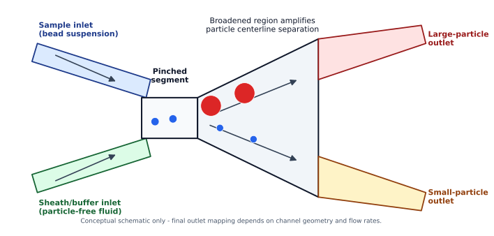

# Pinched Flow Fractionation Microfluidic Device

A design-focused microfluidics project exploring **pinched flow fractionation (PFF)** for size-based separation of polymer microbeads. The concept was built around two bead populations: a small-bead population around **53 µm** and a large-bead population around **500-600 µm**.



## Project snapshot

**Goal:** Design a 3D-printable microfluidic device that uses laminar-flow focusing to separate particles by size.

**Status:** Concept design and technical documentation. This repository does **not** claim experimental validation, separation efficiency, or fabricated device performance.

**Core idea:** In PFF, a particle-containing stream is squeezed against a channel wall by a particle-free sheath/buffer stream. After the pinched region, the channel broadens and the centerlines of differently sized particles follow different streamlines, causing them to exit at different lateral positions.

## What I worked on

- Reviewed the separation principle behind PFF and related microfluidic sorting methods.
- Translated the PFF mechanism into CAD design requirements: inlets, pinched segment, broadening region, and outlet collection paths.
- Iterated from a multi-outlet design toward a simpler two-outlet architecture to reduce unnecessary flow-path variability.
- Considered resin 3D-printing constraints, including minimum feature size, channel height, surface roughness, and post-processing.
- Proposed parylene coating as a surface treatment to improve channel consistency after resin printing.
- Identified a key design risk: the 500-600 µm bead population requires channel dimensions that avoid clogging, so the final constriction and depth need to be checked against the largest particle diameter before fabrication.

## Repository contents

```text
.
├── README.md
├── docs/
│   ├── PFF_Project_Report.docx
│   ├── PFF_Project_Report.pdf
│   ├── PFF_Technical_Brief.md
│   └── PORTFOLIO_BLURB.md
├── assets/
│   ├── pff_schematic.svg
│   └── pff_schematic.png
└── references/
    └── references.bib
```

## Engineering notes

The design is best presented as a **conceptual CAD and literature-based engineering project**, not as a tested microfluidic separator. The strongest parts to highlight are the design process, constraints, and engineering judgment: especially the decision to simplify outlet geometry and the recognition that large-particle PFF introduces clogging and printability risks.

## References

Do not upload downloaded journal PDFs directly unless you have redistribution rights. This repository uses citations instead.

Key sources are listed in [`references/references.bib`](references/references.bib).
